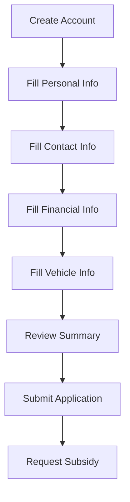
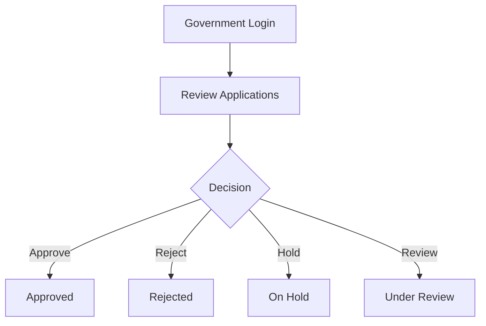
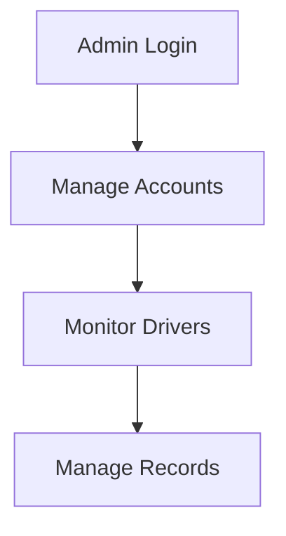
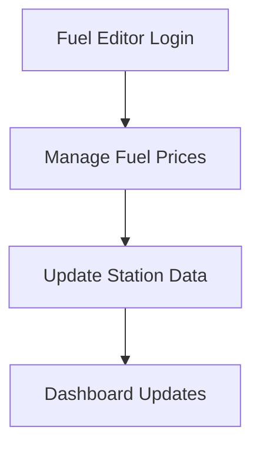

# 🚍 Pantawid Pasada

> A modern Windows Forms desktop application for managing fuel subsidy applications, driver records, fuel prices, fare information, and role-based account access.

---

## ✨ Overview

**Pantawid Pasada** is a role-based management system developed using **C#**, **.NET**, and **MySQL**.
The application streamlines subsidy application workflows for drivers while providing dedicated management tools for administrators, government reviewers, and fuel editors.

Built as an academic system prototype, the project demonstrates:

* Multi-role authentication
* Database-driven desktop application design
* CRUD operations with MySQL
* Dashboard and chart integration
* Real-world workflow simulation
* Secure password handling

---

# 🖥️ System Preview

## 👥 User Roles

| Role                    | Responsibilities                                                         |
| ----------------------- | ------------------------------------------------------------------------ |
| 🚖 **Driver**           | Register account, submit personal/vehicle information, request subsidies |
| 🛡️ **Administrator**   | Manage accounts, monitor system activity, oversee records                |
| 🏛️ **Government User** | Review and update subsidy application statuses                           |
| ⛽ **Fuel Editor**       | Maintain and update fuel pricing information                             |

---

# ✨ Features

## 🔐 Authentication & Security

* Role-based login system
* Password hashing support
* Account management workflows

## 🚖 Driver Management

* Driver registration workflow
* Personal information management
* Contact details management
* Financial information tracking
* Vehicle information management
* Registration summary review

## 🏛️ Subsidy System

* Subsidy request submission
* Application review system
* Approval / rejection workflow
* Under review & on-hold statuses

## ⛽ Fuel Monitoring

* Fuel price management
* Fuel station price tracking
* Online fuel price support
* Fuel dashboards

## 📊 Dashboard & Analytics

* Role-specific dashboards
* Chart visualization using LiveCharts
* Fare matrix viewing

## 📧 Utilities

* Email helper service
* JSON & Parquet support
* HTTP integration support

---

# 🛠️ Tech Stack

| Area            | Technology                               |
| --------------- | ---------------------------------------- |
| 💻 Language     | C#                                       |
| 🪟 UI Framework | Windows Forms                            |
| ⚙️ Runtime      | .NET 10 Windows                          |
| 🗄️ Database    | MySQL                                    |
| 📈 Charts       | LiveChartsCore, SkiaSharp                |
| 📦 Packages     | MySql.Data, Newtonsoft.Json, Parquet.Net |

---

# 📋 Requirements

Before running the project, install:

* ✅ Windows 10 or later
* ✅ Visual Studio 2022 or later
* ✅ .NET 10 SDK
* ✅ MySQL Community Server
* ✅ MySQL Workbench *(recommended)*

### Visual Studio Workload

Install:

```txt
.NET desktop development
```

---

# 🚀 Getting Started

## 1️⃣ Clone the Repository

```bash
git clone https://github.com/En1gM-a/PantawidPasada2.git
cd PantawidPasada2
```

---

## 2️⃣ Open the Project

Open the solution file in Visual Studio:

```txt
PantawidPasada.slnx
```

---

## 3️⃣ Restore NuGet Packages

```bash
dotnet restore
```

---

## 4️⃣ Build the Project

```bash
dotnet build
```

Or press:

```txt
Ctrl + Shift + B
```

inside Visual Studio.

---

# 🗄️ Database Setup

A MySQL database backup is included:

```txt
backup.sql
```

---

## Option A — MySQL Workbench

1. Open MySQL Workbench
2. Connect to your MySQL server
3. Go to:

```txt
Server > Data Import
```

4. Select:

```txt
Import from Self-Contained File
```

5. Choose:

```txt
backup.sql
```

6. Start Import

---

## Option B — Command Line

### Create Database

```sql
CREATE DATABASE IF NOT EXISTS pantawid_pasada;
```

### Import Backup

```bash
mysql -u root -p pantawid_pasada < backup.sql
```

---

# 🔌 Connection String

Update the connection string inside database-related source files:

```cs
server=localhost;
user id=root;
password=YOUR_PASSWORD;
database=pantawid_pasada;
```

---

## 📁 Common Database Files

```txt
dataBaseDetails.cs
SaveDataBase.cs
loginCheck.cs
accessDriverInfo.cs
accessAdminGovAccs.cs
manageAccAdmin.cs
subsidyApp.cs
manageSubsidy.cs
fuelPrice.cs
dashboardPetron.cs
```

---

# ▶️ Running the Application

## Using Visual Studio

1. Open:

```txt
PantawidPasada.slnx
```

2. Set the project as Startup Project
3. Press:

```txt
F5
```

---

## Using CLI

```bash
dotnet run
```

The application launches at the login screen.

---

# 📂 Project Structure

```txt
PantawidPasada/
│
├── Program.cs
├── PantawidPasada.csproj
├── PantawidPasada.slnx
├── backup.sql
│
├── Form1.cs                  # Login screen
├── Form2.cs                  # Driver registration
├── Form3.cs                  # Driver panel
│
├── adminPanel.cs
├── governmentPanel.cs
├── homeAdmin.cs
├── homeDriver.cs
├── homeGovernment.cs
├── homePetroncs.cs
│
├── personalInfo.cs
├── contact.cs
├── financialInfo.cs
├── vehicleInfo.cs
├── summary.cs
│
├── subsidyApp.cs
├── requestSubsidy.cs
├── manageSubsidy.cs
│
├── fuelPrice.cs
├── fuelPriceONLINE.cs
├── fuelPricewithStation.cs
├── manageFuel.cs
├── dashboardPetron.cs
├── forGraph.cs
│
├── manageAccAdmin.cs
├── accessDriverInfo.cs
├── accessAdminGovAccs.cs
├── loginCheck.cs
├── HashPassword.cs
├── SaveDataBase.cs
├── SendEmail.cs
│
├── Resources/
└── Properties/
```

---

# 🔄 Main Workflows

## 🚖 Driver Workflow



---

## 🏛️ Government Workflow



---

## 🛡️ Admin Workflow



---

## ⛽ Fuel Editor Workflow



---

# 📦 Packages Used

```txt
LiveChartsCore
SkiaSharp
MySql.Data
Newtonsoft.Json
Parquet.Net
System.Net.Http
```

---

# 🤝 Notes for Contributors

* Keep `.Designer.cs` files managed through Visual Studio Designer
* Avoid committing:

  * `bin/`
  * `obj/`
  * `.vs/`
  * database credentials
* Keep UI assets inside the `Resources/` folder
* Test database workflows after schema changes
* Update `backup.sql` when modifying the database schema

---

# ⚠️ Disclaimer

> This project is an academic/student prototype system for managing Pantawid Pasada-related workflows.
> It is **not** an official government system.

---

# ⭐ Future Improvements

* 🌐 Cloud database support
* 📱 Mobile companion application
* 🔔 Real-time notifications
* 📊 Advanced analytics dashboard
* 🔒 JWT or OAuth authentication
* ☁️ Deployment support
* 📡 API integration for live fuel pricing

---

# 👨‍💻 Developers

Developed as a Computer Engineering project using:

* C#
* Windows Forms
* MySQL
* .NET 10

---

# ⭐ Support the Project

If you found this project useful:

```txt
⭐ Star the repository
🍴 Fork the project
🐛 Report issues
🚀 Contribute improvements
```
